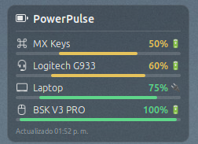

# PowerPulse

**Desklet para Linux Mint Cinnamon** que muestra de forma rápida y visual el nivel de batería de tus dispositivos inalámbricos.

Combina **UPower** (D-Bus) y **HeadsetControl** en una tarjeta compacta sobre el escritorio.



<p align="center">
  <em>MX Keys · Logitech G933 · Laptop · Basilisk V3 Pro — ordenados por batería ascendente</em>
</p>

---

## Características

- Descubrimiento automático de baterías vía **UPower** (portátil, teclado, ratón, headset, etc.)
- Soporte opcional de **HeadsetControl** (p. ej. Logitech G933)
- Vista **compacta**: icono, nombre, porcentaje y barra
- Vista **expandida** al hacer clic (detalles in-place, sin ventanas)
- Resumen global al hacer clic en el título **PowerPulse**
- Orden configurable (por defecto: batería ascendente — lo más bajo primero)
- Indicadores visuales: ⚡ carga · 🔌 enchufe · 🔋 batería · ⚠ baja · 🟥 crítico
- Notificaciones de batería baja (una sola vez por ciclo)
- Temas claros/oscuros, HiDPI, localización ES/EN
- Arquitectura modular lista para nuevos proveedores (OpenRazer, Solaar, Bluetooth…)

## Requisitos

| Componente | Obligatorio | Notas |
|------------|-------------|--------|
| Linux Mint Cinnamon 6.x | Sí | Probado en Cinnamon 6.6 / Mint 22 |
| UPower | Sí | Incluido en Mint |
| [HeadsetControl](https://github.com/Sapd/HeadsetControl) | No | Solo para auriculares compatibles (G933, etc.) |

Sin HeadsetControl, PowerPulse sigue mostrando todos los dispositivos reportados por UPower.

## Instalación

```bash
git clone https://github.com/vicman/PowerPulse.git
cd PowerPulse
chmod +x install.sh uninstall.sh
./install.sh
```

El script copia el Desklet a:

```text
~/.local/share/cinnamon/desklets/powerpulse@vicman.app/
```

Luego:

1. Clic derecho en el escritorio → **Añadir Desklets…**
2. Busca **PowerPulse** y añádelo

### Desinstalación

```bash
./uninstall.sh
```

## Uso rápido

| Acción | Resultado |
|--------|-----------|
| Clic en un dispositivo | Expande / contrae sus detalles |
| Clic en **PowerPulse** | Resumen global (conteos, proveedores, versión) |
| Clic derecho | Menú contextual |
| Menú → **Actualizar ahora** | Fuerza una lectura nueva |

### Menú contextual

- Actualizar ahora
- Gestión de energía
- Ordenar por…
- Modo compacto
- Expandir / contraer todo
- Configuración
- Copiar resumen

## Configuración

Desde el menú del Desklet o *Preferencias → Desklets → PowerPulse*:

- Intervalo de actualización
- Orden predeterminado (batería ↑ / ↓, nombre, tipo, última actualización, manual)
- Nombre amigable de la batería del portátil (por defecto `Laptop`)
- Mostrar solo conectados, iconos, porcentaje, barras
- Tiempo restante, voltaje, salud y ciclos (en la vista expandida)
- Umbral de batería baja y notificaciones
- Comando y timeout de HeadsetControl

## Captura


## Arquitectura

Diseñado para ampliar proveedores **sin tocar el núcleo de la UI**:

```text
powerpulse@vicman.app/
├── desklet.js              # Orquestador
├── providers/              # UPower, HeadsetControl (+ futuros)
├── models/                 # Modelo de dispositivo y ordenación
├── ui/                     # Tarjetas y panel de resumen
├── animations/             # Animaciones cortas
├── utils/                  # Formato y parser
├── settings/
├── stylesheet.css
├── settings-schema.json
└── metadata.json
```

Proveedores previstos a futuro: OpenRazer, Solaar, Bluetooth Battery Service, gamepads, UPS, stylus, Android/iPhone, Apple Magic Devices.

## Desarrollo

```bash
# Editar → reinstalar → recargar Cinnamon (Alt+F2 → r → Enter)
./install.sh

# Pruebas unitarias del parser / ordenación
node tests/run_tests.js

# Diagnóstico del sistema
./diagnose.sh
upower -e
headsetcontrol -b
```

## Identidad

| | |
|--|--|
| **Nombre** | PowerPulse |
| **UUID** | `powerpulse@vicman.app` |
| **Versión** | 1.2.0 |
| **Autor** | VicMan |
| **Licencia** | [GPL-3.0](LICENSE) |
| **Plataforma** | Linux Mint Cinnamon 6.x |

## Licencia

Este proyecto se distribuye bajo los términos de la **GNU General Public License v3.0**.  
Consulta el archivo [LICENSE](LICENSE) para el texto completo.
